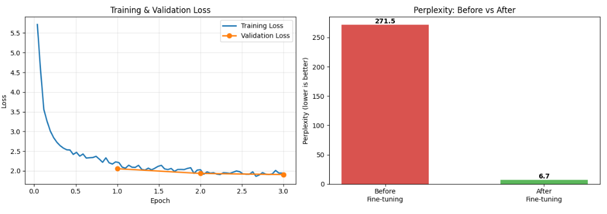

# Contextual Chatbot with Multi-turn Dialogue Understanding

Fine-tuning **DialoGPT-small** on the **MultiWOZ 2.2** dataset to build a task-oriented chatbot that maintains context across multiple conversational turns.

[](https://www.kaggle.com/code/nermeenmohamedrizk/contextual-chatbot-multiwoz-dialogue-understanding)


---

## The Problem

A single-turn chatbot treats every message independently. In a real booking conversation, most turns only make sense in context:

> **User:** I'm looking for an expensive restaurant in the centre
> **User:** What is **its** phone number?
> **User:** Can you book **it** for 2 people?

Turns 2 and 3 contain no explicit entity — *"its"* and *"it"* refer back to the restaurant established in turn 1. Resolving these references is the core challenge this project addresses.

---

## Approach

| Component | Choice |
|---|---|
| Dataset | MultiWOZ 2.2 (8,437 multi-domain task-oriented dialogues) |
| Base model | `microsoft/DialoGPT-small` (117M parameters) |
| Task framing | Causal LM over `(dialogue context → system response)` pairs |
| Context window | Last 4 turns |
| Loss masking | Computed on response tokens only |
| Training data | 1,500 dialogues → 10,196 context-response pairs |

### What makes the model contextual

Rather than concatenating whole dialogues and training on every token, each system turn becomes one training example:

```
input  = [last 4 turns] <|endoftext|> [system response] <|endoftext|>
labels = [   -100 ...  ]              [system response] <|endoftext|>
```

Context tokens are labelled `-100`, which PyTorch's cross-entropy ignores. The gradient therefore only reflects how well the model produces the **response** — it learns to reply, not to imitate the user.

---

## Results

| Metric | Value |
|---|---|
| Validation loss | 1.91 |
| **Perplexity** | **6.73** (down from ~271 before fine-tuning) |
| BLEU-4 | 5.19 (150 test samples) |



Validation loss tracks training loss closely across all three epochs with no divergence — the model is not overfitting.

### Sample conversation (beam search)

```
User: I am looking for an expensive restaurant in the center
Bot : There are several expensive restaurants in the centre. Do you have a price range in mind?

User: What is its phone number?
Bot : The phone number is 01223358966. Can I help you with anything else?

User: Can you book it for me for 2 people?
Bot : Booking was successful. The table will be reserved for 15 minutes.
      Reference number is : 4Q1G4Y. Is there anything else I can help you today?
```

The model resolves *"its"* and *"it"* across turns without the entity being restated.

---

## Key Findings

**1. Loss masking is what makes the model contextual.** Restricting the loss to response tokens is the difference between a model that replies and a model that imitates the conversation.

**2. Decoding strategy dominated output quality.** The same checkpoint produced degenerate text under sampling (`top_p=0.9`, `temperature=0.8`) and clean, well-formed responses under beam search (`num_beams=4`, `early_stopping=True`) — a larger effect than any training hyperparameter.

**3. Library versions are part of the experiment.** `transformers` 5.0.0 does not preserve GPT-2's weight tying between the input embeddings and the `lm_head`, causing training to diverge to `NaN` within a single optimizer step. The failure looked like a data or hyperparameter bug. Pinning `transformers==4.44.2` restored the correct architecture.

---

## Limitations

The model has no access to a database, so entity-specific values (phone numbers, reference codes, train times) are generated from learned surface patterns rather than retrieved. They are *stylistically* correct and *factually* arbitrary. Production task-oriented systems close this gap by coupling dialogue state tracking to a database lookup.

BLEU also understates performance here. Consider an actual test case:

```
Context   : I need train reservations from norwich to cambridge
Reference : I have 133 trains matching your request. Is there a specific day and time you would like to travel?
Generated : What day would you like to travel?
```

The generated response is appropriate and natural. BLEU scores it poorly only because it shares few n-grams with this particular reference. Open-ended dialogue admits many valid responses per context, and single-reference BLEU credits exactly one of them.

---

## Running the notebook

The notebook runs on Kaggle with a **GPU T4** accelerator and **Internet enabled**.

1. Run the install cell
2. **Restart the kernel** — Python caches imported modules, so the newly pinned `transformers` is not picked up until the interpreter restarts
3. Run the remaining cells in order

> **Note.** Kaggle's current image is built on NumPy 2.x while `transformers==4.44.2` pins `numpy<2`. Installing it downgrades NumPy, which breaks binary compatibility with pre-installed packages in a clean batch environment. The notebook therefore runs interactively with a kernel restart after the install cell. A fully self-contained run would require a pinned Docker image or a virtual environment.

---

## Future Work

- Dialogue State Tracking over MultiWOZ's `frames` annotations, with database grounding
- Scaling to the full 8,437 dialogues and to `DialoGPT-medium`
- Human evaluation, which reflects dialogue quality better than single-reference BLEU

---

## Links

- **Kaggle notebook:** [contextual-chatbot-multiwoz-dialogue-understanding](https://www.kaggle.com/code/nermeenmohamedrizk/contextual-chatbot-multiwoz-dialogue-understanding)
- **Dataset:** [MultiWOZ 2.2](https://huggingface.co/datasets/multi_woz_v22)
- **Base model:** [microsoft/DialoGPT-small](https://huggingface.co/microsoft/DialoGPT-small)

---

*Built as part of an NLP training program.*
